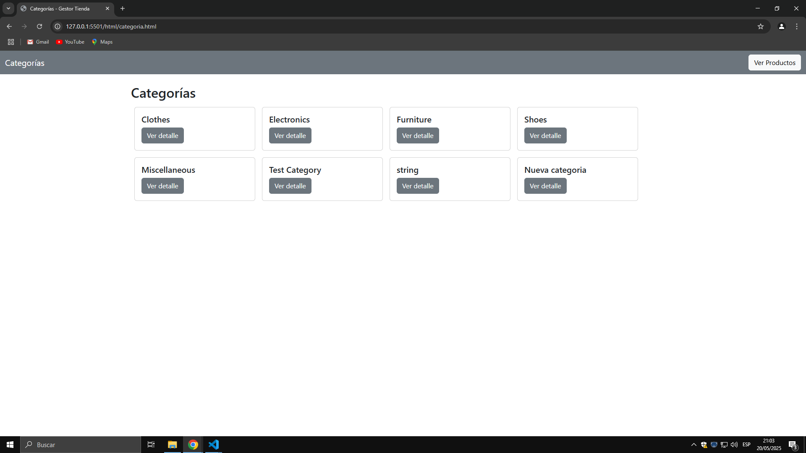
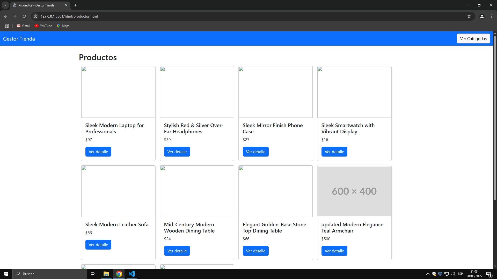
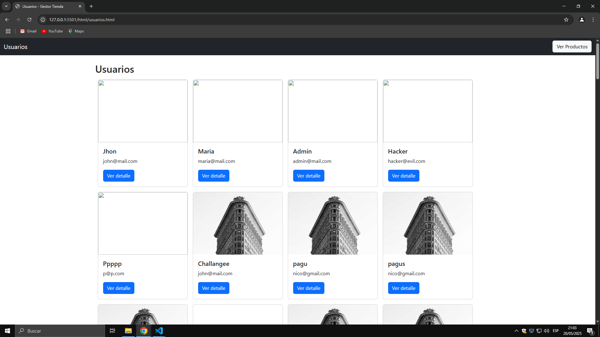

es una pagina web creada con html, css y jss, incorporandole boostrap, consumiendo una api publica

José Jair Beleño Casique 192172
Nataly Duarte Remolina 192309

instrucciones:
1.  clonar la el siguiente repositorio en su escritorio: https://github.com/Jbeleno222/gestor-tienda-front-parcial-2.git
2. abrir la carpeta del proyecto
3. abrir el archivo index.html
4. disfrutar la pagina

evidencias:

